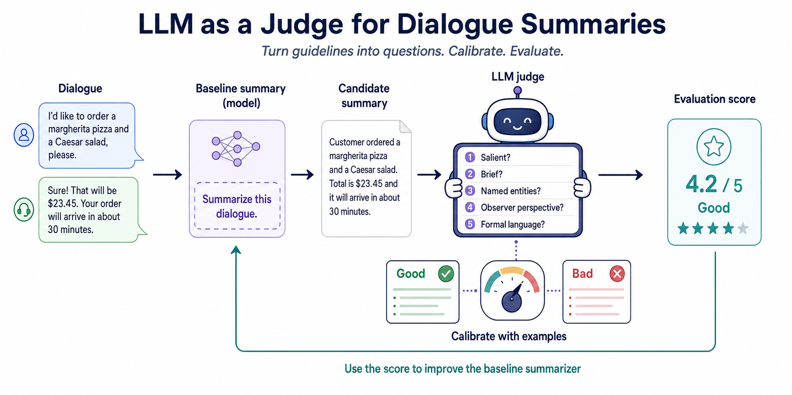

# LLM Judge Calibration for Conversation Summaries

Build a conversation summarizer for a restaurant chain, discover the limits of reference-based metrics, and calibrate an LLM judge against human-labelled examples.



## Product scenario

A restaurant chain wants to learn from customer conversations without asking its owners to read every transcript. The owners supplied example summaries and five rules for good summaries: preserve salient information, remain brief, retain important named entities, use an observer's perspective, and use formal language.

The quest follows one product loop: generate summaries, evaluate them, calibrate the evaluator, and use its evidence to improve the summarizer.

## Builder flow

1. Read `challenge.json` and choose a pending milestone.
2. Complete its tasks and save learner-created files under `user_artifacts/`.
3. Mark the milestone ready for judgment:

```bash
python scripts/mark_ready.py --milestone build_llm_judge --notes "Implemented and ran the initial structured judge"
```

4. Use the generated artifacts as checkpoints while moving through the live build.

Optional tasks do not block challenge completion and are skipped by milestone and `--all` readiness commands.

## Streamlit

Run with the quest requirements through `uv`:

```bash
uv run --with-requirements requirements.txt streamlit run app.py
```

The Streamlit workspace shows milestone summaries, progressive hints, expected artifacts, progress, and milestone-specific restart controls.
